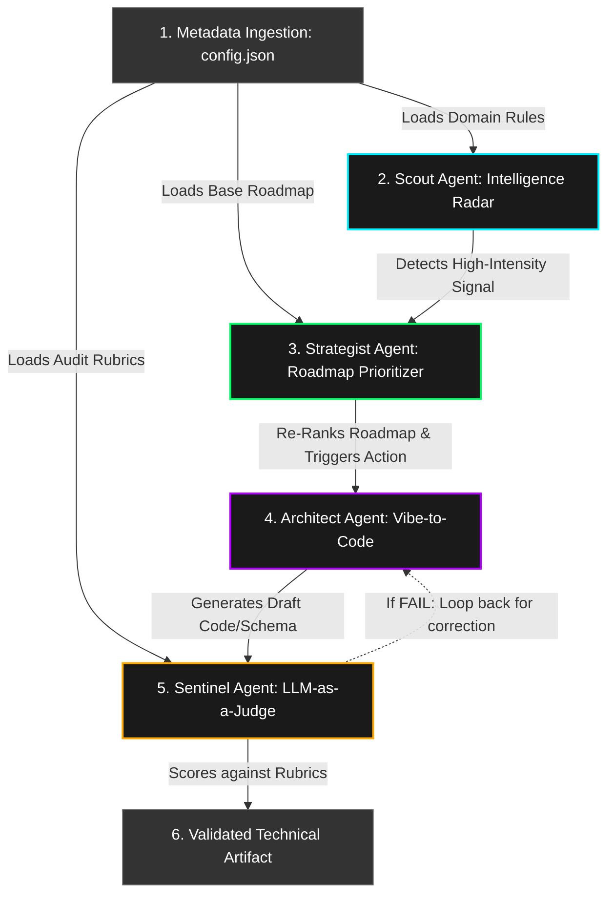

# Agentic Strategic Command Center: End-to-End Workflow

This document outlines the end-to-end operational workflow of the Agentic Strategic Command Center, demonstrating how raw market intelligence is autonomously translated into validated technical execution.

## The OODA Loop Execution

The system simulates the **Observe, Orient, Decide, Act** (OODA) loop through an event-driven cascade across four autonomous agents.

## Step-by-Step Walkthrough

### 1. Initialization (Metadata Bootstrapping)
*   The application boots and ingests `config.json`.
*   This file establishes the domain (e.g., Health-Tech), sets the base product roadmap priorities, and defines the specific `judge_rubrics` (e.g., "Clinical Faithfulness", "OWASP Security").

### 2. Observation (The Scout Agent)
*   **Trigger:** External market shifts (e.g., a new ABDM regulatory mandate or a competitor's performance dip).
*   **Action:** The Scout Agent intercepts this data, scores its `intensity` (1-10), and displays it on the interactive **Cyber-Signal Radar**.
*   **End State:** The signal waits for user interaction (in the prototype) or autonomous processing (in a fully headless deployment).

### 3. Orientation & Decision (The Strategist Agent)
*   **Trigger:** The Scout Agent flags a signal as active/high-priority (e.g., Intensity > 8).
*   **Action:** The Strategist Agent ingests the active signal and runs it against the current product roadmap. It calculates the strategic alignment vs. effort.
*   **End State:** The roadmap is instantly visually re-ranked. Low-priority features are pushed down, and the feature best suited to address the signal (e.g., "Identity Vault") is elevated to "Priority 1 (Urgent)".

### 4. Action (The Architect Agent)
*   **Trigger:** A roadmap item is escalated to "Urgent".
*   **Action:** The Architect Agent (Vibe Coding engine) begins generating functional technical requirements. It leverages generative AI to output immediate, actionable boilerplate—such as API schemas, mitigation scripts, or zero-trust identity policies.
*   **End State:** Raw, draft technical code is displayed in the **Vibe-to-Code Accelerator** pane.

### 5. Validation (The Sentinel Agent)
*   **Trigger:** The Architect Agent completes its code generation.
*   **Action:** The Sentinel Agent intercepts the draft code. Acting as an "LLM-as-a-Judge," it audits every line of the output against the `judge_rubrics` loaded during Initialization.
*   **End State:** The terminal displays a scorecard. If the output meets the "will" protocol and passes all domain constraints (e.g., Security Hardening = PASS), the artifact is finalized and ready for human deployment.

### 6. Value Realization
*   This entire end-to-end cascade happens in milliseconds, allowing the product team to close the "Execution Gap" faster than competitors, driving immediate B2B conversions and preventing technical waste.
